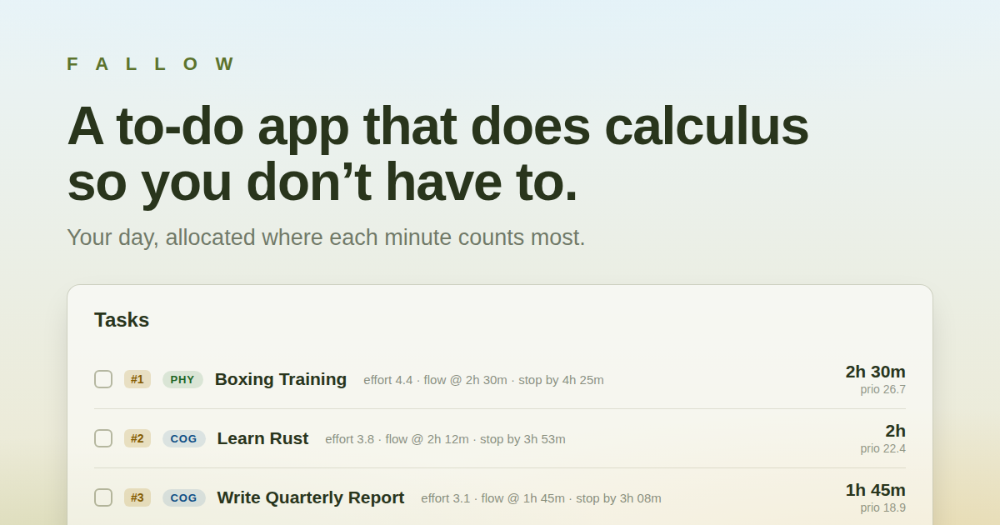

# Fallow

**A to-do app that does calculus so you don't have to.**



Fallow answers a question every productive day poses: _you have N tasks and only
so many hours — how should you split your time to get the most out of the day?_
Instead of guessing (or splitting time equally), Fallow models each task's
productivity curve and solves for the time allocation that maximizes your total
output, subject to your real limits: the hours in your day and how much
mental and physical energy you can actually sustain.

It started as a faithful, over-engineered implementation of the
[Zenith Gradient Algorithm](https://thequantasticjournal.com/how-to-over-engineer-a-todo-app-the-zenith-gradient-algorithm-67712737135e)
and has since revised the article's math where it didn't hold up (model v2),
extended with a dual energy-pool model, context-switching costs, and a
personalization loop that learns your constants from measured data.
**[MATH.md](MATH.md) is the authoritative record of the implemented math** —
every formula, derivation, and deviation from the article, with rationale.

---

## The idea in one picture

For any task, productivity over time isn't flat — it starts at some initial
level, ramps up as you get into the zone, peaks at **flow state**, then decays
as you tire:

```text
p(t) = (a·k·t + p₀) · e^(−kt)      k = (1 − p₀/a)/ϕ
```

Each task is described by three things you feel intuitively:

- **Effort / difficulty** (`E`) — how demanding the task is
- **Enjoyment** (`β`) — how much you like doing it
- **Time to flow** (`ϕ`) — how long before you hit the zone

These shape the curve: enjoyable, low-effort tasks start productive (`p(0) = p₀`
really holds — a v2 fix over the article's curve); hard, unpleasant ones start
slow but peak higher. There's a mathematically optimal point to stop each task —
between 1.5×ϕ and 1.79×ϕ depending on the task — because working past it makes
your _average_ productivity for that task fall.

Fallow takes your whole task list and finds the allocation `⟨t₁, t₂, … tₙ⟩` that
maximizes the sum of average productivities. Plans are built in **15-minute
blocks** and solved exactly: greedy marginal analysis over block values, with an
exhaustive search over which tasks deserve funding at all once context-switch
costs are charged — then Fallow reports how much better that is than an equal
split. (Full derivations: [MATH.md](MATH.md).)

## What Fallow adds on top of the article

- **A revised curve and per-task stopping times (model v2).** The article's
  curve forced `p(0) = 0`, contradicting its own "initial productivity" story;
  v2 uses a curve where `p(0) = p₀` truly holds, which makes the optimal
  stopping point task-dependent (1.5–1.79 × ϕ) instead of a universal
  constant. See [MATH.md](MATH.md) §2–3.
- **Dual energy pools.** Cognitive and physical fatigue are separate systems.
  "6h of coding" saturates your ~4h/day of intense mental work, but "4h coding +
  2h gym" fits — the physical hours draw on a different pool. The allocator
  solves a three-constraint problem (time + cognitive pool + physical pool),
  so plans never schedule an unsustainable day.
- **Context-switching costs.** Every task you juggle costs ~15 minutes of
  overhead (grounded in attention-residue research). Fallow charges switches
  only between tasks that actually get time, and will _drop_ a weak task when
  the switch it costs outweighs its value — decided by exhaustively comparing
  every funded-task subset.
- **Personalization from your own data.** Log how long a task really took to
  reach flow (the ⚡ button, stopwatch-style) and Fallow refits your personal
  constants (`c₁, c₂, c₃`) with a Bayesian linear regression — anchored to the
  article's defaults, sharpening as you log more, and aware of how uncertain
  its own predictions still are.
- **A dashboard of derived metrics.** Fallow Gain, Burnout Risk, Flow Coverage,
  Cognitive/Physical Load, Energy Balance, Friction Index, Recovery Ratio, and
  more — each computed from the same underlying model.
- **Suggested run order.** Alternates cognitive and physical tasks so the
  resting energy system recovers while the clock keeps running.
- **History & routines.** Sessions are saved per day (browse past days
  read-only) and you can save task templates as reusable routines. Everything
  lives locally in IndexedDB — no account, no server.

## How you use it

1. Add tasks. For each, set **physical difficulty**, **mental difficulty**, and
   **enjoyment** on 1–10 sliders.
2. Set your **available hours** for the day, and optionally tune your
   cognitive/physical capacity pools and switch cost.
3. Fallow suggests how many hours to give each task, what order to do them in,
   and surfaces a live dashboard of what your day looks like.
4. Optionally log your actual time-to-flow on tasks to personalize the model.

## Tech stack

- [SvelteKit 2](https://svelte.dev/docs/kit) + [Svelte 5](https://svelte.dev/) (runes)
- [Tailwind CSS 4](https://tailwindcss.com/) with shadcn-svelte / bits-ui components
- TypeScript, [Vite](https://vite.dev/)
- IndexedDB for local persistence
- [Vitest](https://vitest.dev/) (unit) + [Playwright](https://playwright.dev/) (e2e), [Storybook](https://storybook.js.org/) for components
- Deployed on Vercel (`@sveltejs/adapter-vercel`)

The productivity math lives in
[`src/lib/business/model/zenith.ts`](src/lib/business/model/zenith.ts) (pure,
dependency-free functions — derivations in [MATH.md](MATH.md)) and the
task/dashboard logic in
[`src/lib/business/model/metric/calculation.ts`](src/lib/business/model/metric/calculation.ts).
Architecture and conventions: [docs/code-conventions.md](docs/code-conventions.md).

## Getting started

```sh
npm install
npm run dev          # start the dev server (add -- --open to open a tab)
```

### Other commands

```sh
npm run build        # production build
npm run preview      # preview the production build
npm run test         # unit tests (vitest) + e2e (playwright)
npm run test:unit    # unit tests only
npm run check        # svelte-check type checking
npm run storybook    # component explorer on :6006
```

## Credits

Based on
["How to Over-Engineer a To-Do App: The Zenith Gradient Algorithm"](https://thequantasticjournal.com/how-to-over-engineer-a-todo-app-the-zenith-gradient-algorithm-67712737135e)
from The Quantastic Journal.
</content>
